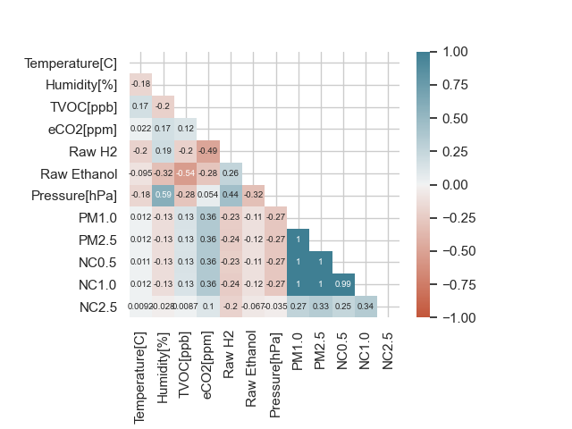

# Smoke-Detection-Kaggle
# Introduction

The Fire Alarm System is designed to alert individuals in the event of a fire or other emergency situations related to fire or general emergencies. It can detect smoke, fire, carbon monoxide, and other critical situations. The alarms can be automatically triggered by smoke detectors and heat detectors or manually activated through alarm activation devices such as manual call points or manual stations.

The data collection for this project was done using IoT devices as the goal was to develop a smoke detection device based on artificial intelligence. The collected attributes include:

| Attribute        | Description                                          |
|------------------|------------------------------------------------------|
| UTC              | Time when the experiment was conducted               |
| Temperature[C]   | Ambient temperature measured in degrees Celsius      |
| Humidity[%]      | Air humidity during the experiment                   |
| TVOC[ppb]        | Total Volatile Organic Compounds concentration in ppb |
| eCO2[ppm]        | Equivalent CO2 concentration in ppm                  |
| Raw H2           | Amount of raw hydrogen present in the environment    |
| Raw Ethanol      | Amount of raw ethanol present in the environment     |
| Pressure[hPa]    | Air pressure in hPa                                  |
| PM1.0            | Particles with a diameter less than 1.0 micrometers  |
| PM2.5            | Particles with a diameter less than 2.5 micrometers  |
| NC0.5            | Concentration of particles with diameter < 0.5 um    |
| NC1.0            | Concentration of particles with diameter < 1.0 um    |
| NC2.5            | Concentration of particles with diameter < 2.5 um    |
| CNT              | Number of samples                                    |
| Fire Alarm       | Binary target variable indicating fire alarm status  |

The objective of the project is to classify the data based on whether the Fire Alarm has been triggered (1) or not (0).

## 2. Dataset
### 2.1 Data Display and Information
| Index | Column         | Non-Null Count | Dtype    |
|-------|----------------|----------------|----------|
| 0     | Temperature[C] | 62630          | float64  |
| 1     | Humidity[%]    | 62630          | float64  |
| 2     | TVOC[ppb]      | 62630          | int64    |
| 3     | eCO2[ppm]      | 62630          | int64    |
| 4     | Raw H2         | 62630          | int64    |
| 5     | Raw Ethanol    | 62630          | int64    |
| 6     | Pressure[hPa]  | 62630          | float64  |
| 7     | PM1.0          | 62630          | float64  |
| 8     | PM2.5          | 62630          | float64  |
| 9     | NC0.5          | 62630          | float64  |
| 10    | NC1.0          | 62630          | float64  |
| 11    | NC2.5          | 62630          | float64  |
| 12    | Fire Alarm     | 62630          | int64    |

Important information from the image:
- There are 12 attributes and one target variable.
- Each column contains 62,630 data points.
- There are no NULL values in any column.
- All data types are either float or int, indicating that there is no need to adjust data types.

### 2.2 Handling Outliers
The Z-score method, also known as standardization or normalization, is a technique used to transform data into a standard scale. It represents the number of standard deviations that a data point is away from the mean. It tells us how relatively close or far a data point is from the average.

The formula for calculating the z-score of a data point (x) is:
z = (x - μ) / σ

Where:
- x is the current data point,
- μ is the mean (average),
- σ is the standard deviation.

By standardizing data using the z-score method, you can ensure that variables with different scales and distributions are on a comparative scale. This is particularly useful in machine learning algorithms that rely on computing distances or when comparing variables with different units or ranges.

It allows for the identification of outliers as data points with z-score values that exceed a certain threshold (e.g., ±2 or ±3). In this case, a threshold value of 2.5 has been chosen. After applying this procedure, the data distributions look as follows:

Size of the data after this is 57534.

### 2.3 Correlation Matrix
The correlation matrix is a square matrix used to display the correlation between different variables in a dataset. Each element of the matrix represents the correlation coefficient between corresponding pairs of variables. The correlation coefficient values range between -1 and 1. A value of 1 indicates a perfect positive correlation, meaning that the variable values increase together. A value of -1 indicates a perfect negative correlation, meaning that the variable values decrease together. A value close to zero indicates a lack of correlation or a weak linear relationship between variables.

The correlation matrix helps us understand the relationships and dependencies between variables in the dataset. It can be visualized as a heatmap, with colors representing the strength and direction of the correlations. Positive correlations are typically represented by warmer colors (e.g., red), while negative correlations are represented by cooler colors (e.g., blue).

To calculate the correlation matrix, we use a statistical measure called the correlation coefficient, such as Pearson's correlation coefficient. It measures the linear relationship between two variables and ranges from -1 to 1, with 0 indicating no linear relationship.

The correlation matrix shown below represents the data from the dataset after the removal of anomalies. The pairs (PM1.0, NC1.0) , (PM2.5, NC0.5), (NC0.5, NC1.0), (PM2.5, PM1.0), (PM1.0, NC0.5) and (PM2.5, NC1.0) exhibit a high positive correlation of 0.99. Based on the high correlation between PM1.0 and NC1.0, as well as between PM2.5 and NC1.0, the variables PM1.0 and PM2.5 were removed to examine the dependency without them. Additionally, it is possible to exclude NC1.0 and NC2.5, but doing so slightly reduces the accuracy of the algorithms.

### 2.4 Data Balancing
Data balancing is a technique used to address the issue of imbalanced class distribution in a dataset. When we encounter an imbalanced distribution, it means that one class has a significantly smaller number of samples compared to the other.

Imbalanced datasets can pose challenges in machine learning models, as they tend to bias the model towards the majority class, leading to poor performance on the minority class. To overcome this, data balancing techniques are applied to adjust the class distribution and provide equal representation for all classes.

NearMiss is an undersampling method that aims to balance the class distribution by selectively removing samples from the majority class based on their proximity to the minority class. NearMiss selects samples from the majority class that are closest to the minority class instances, ensuring a more balanced dataset for training a classification model.

<table>
  <tr>
    <td></td>
    <td></td>
  </tr>
</table>

### 3 Classification
#### 3.1 Train-Test Split
The dataset was divided in such a way that 30% of the data was used for testing, while the remaining portion was used for training.

#### 3.2 Data Scaling
Data scaling is a preprocessing step that aims to bring all features to a similar scaled value. For this project, the MinMaxScaler() function was used. The working principle is as follows:
scaled_value = (value - min_value) / (max_value - min_value)

This formula transforms the original attribute values to a range between 0 and 1, where the minimum becomes 0 and the maximum becomes 1. It operates independently on each attribute, scaling them individually based on their minimum and maximum values. This ensures that all attributes are on a similar scale and prevents any particular attribute from dominating the analysis based on its original magnitude.

#### 3.3 Used Algorithms
Four machine learning classification algorithms were employed in this project:
1. Logistic Regression
2. K-Nearest Neighbors (KNN)
3. Decision Tree
4. Random Forest Classifier

### 4 Experiments and Results
#### 4.1 Results of Basic Algorithms
|       Name              | Confusion Matrix | Accuracy | F Score | Precision | Recall | Time Taken |
|-------------------------|-----------------|----------|---------|-----------|--------|------------|
| KNeighborsClassifier    |   [4461, 0]     |  100.0   |  100.0  |   100.0   |  100.0 |  0.244737  |
|                         |   [0, 4461]     |          |         |           |        |            |
| LogisticRegression      |   [4452, 9]     |   99.9   |   99.9  |    99.8   |  100.0 |  0.054865  |
|                         |   [0, 4461]     |          |         |           |        |            |
| DecisionTreeClassifier  |   [4461, 0]     |  100.0   |  100.0  |   100.0   |  100.0 |  0.022995  |
|                         |   [0, 4461]     |          |         |           |        |            |
| RandomForestClassifier  |   [4461, 0]     |  100.0   |  100.0  |   100.0   |  100.0 |  0.814029  |
|                         |   [0, 4461]     |          |         |           |        |            |

Based on these results, both KNeighborsClassifier and DecisionTreeClassifier achieved excellent performance with very high accuracy, precision, and recall scores. LogisticRegression also performed well but with slightly lower accuracy compared to the other two models. The RandomForestClassifier exhibited the best performance. It is important to note that all algorithms (after tuning) had 0 false negatives, meaning that there were no cases where the alarm should have been triggered but wasn't.

### 4.2 Hyperparameter Tuning with Cross-Validation

|       Name              |                                    Best Params                                    | New Accuracy |
|-------------------------|-----------------------------------------------------------------------------------|--------------|
| KNeighborsClassifier    | {'metric': 'euclidean', 'n_neighbors': 3, 'weights': 'uniform'}                   |    100.00    |
| LogisticRegression      | {'C': 10.0, 'penalty': 'l1', 'solver': 'liblinear'}                               |     99.97    |
| DecisionTreeClassifier  | {'ccp_alpha': 0.001, 'criterion': 'entropy', 'splitter': 'random'}                |    100.00    |

## 5 Feature Selection
Feature selection methods aim to select relevant and informative features for building a prediction model. Two commonly used feature selection methods are Principal Component Analysis (PCA) and Lasso regularization. Prior to applying these methods, it is necessary to standardize the data to ensure their effectiveness. Additionally, experimenting with different parameters and evaluating the impact of these methods on model performance is required.

### 5.1 Principal Component Analysis (PCA)
PCA is a dimensionality reduction technique that transforms the original features into a new set of independent variables called principal components. The main idea is to reduce the number of features while retaining the variance of the data. The choice of the number of principal components depends on the desired dimensionality and the estimated variance. 

The GridSearchCV() was used to find the optimal number of components, which was mostly found to be 6.

### 5.2 Lasso Regularization
Lasso (Least Absolute Shrinkage and Selection Operator) is a linear modeling technique that performs regularization and feature selection. Penalties are added to the objective function, which motivates the model to shrink the coefficients of irrelevant attributes to zero. The strength of regularization is adjusted by the "alpha" parameter in the Lasso model. A higher value of this parameter results in more attribute coefficients being reduced to zero, effectively ending up with fewer final attributes. Here, a value of 0.02 was selected as the best value. As a result, the following 5 attributes were dropped: PM1.0, PM2.5, NC1.0, and NC2.5.
|   Feature       | Coefficient   |
|-----------------|---------------|
| Pressure[hPa]   | -0.165927     |
| NC0.5           | 0.033058      |
| Humidity[%]     | -0.004306     |
| Raw Ethanol     | -0.001086     |
| eCO2[ppm]       | 0.000763      |
| Raw H2          | 0.000340      |
| TVOC[ppb]       | -0.000137     |
| Temperature[C]  | 0.000066      |
| PM1.0           | 0.000000      |
| PM2.5           | 0.000000      |
| NC1.0           | 0.000000      |
| NC2.5           | -0.000000     |

### 5.3 Results

**All data:**

|                     Name                     | Confusion Matrix | Accuracy | F score | Precision | Recall |
|----------------------------------------------|------------------|----------|---------|-----------|--------|
|    KNeighborsClassifier                       | [4459, 2]       | 99.98    | 99.98   | 99.96     | 100.0  |
|                                               | [0, 4461]       |          |         |           |        |
|    LogisticRegression                         | [4455, 6]       | 99.93    | 99.93   | 99.87     | 100.0  |
|                                               | [0, 4461]       |          |         |           |        |
|    DecisionTreeClassifier                     | [4461, 0]       | 100.0    | 100.0   | 100.0     | 100.0  |
|                                               | [0, 4461]       |          |         |           |        |

**PCA:**

|                     Name                     | Confusion Matrix | Accuracy | F score | Precision | Recall |
|----------------------------------------------|------------------|----------|---------|-----------|--------|
|    KNeighborsClassifier                       | [4460, 1]       | 99.99    | 99.99   | 99.98     | 100.0  |
|                                               | [0, 4461]       |          |         |           |        |
|    LogisticRegression                         | [4453, 8]       | 99.91    | 99.91   | 99.82     | 100.0  |
|                                               | [0, 4461]       |          |         |           |        |
|    DecisionTreeClassifier                     | [4461, 0]       | 100.0    | 100.0   | 100.0     | 100.0  |
|                                               | [0, 4461]       |          |         |           |        |

**Lasso:**

|                     Name                     | Confusion Matrix | Accuracy | F score | Precision | Recall |
|----------------------------------------------|------------------|----------|---------|-----------|--------|
|    KNeighborsClassifier                       | [4460, 1]       | 99.99    | 99.99   | 99.98     | 100.0  |
|                                               | [0, 4461]       |          |         |           |        |
|    LogisticRegression                         | [4450, 11]      | 99.88    | 99.88   | 99.75     | 100.0  |
|                                               | [0, 4461]       |          |         |           |        |
|    DecisionTreeClassifier                     | [4461, 0]       | 100.0    | 100.0   | 100.0     | 100.0  |
|                                               | [0, 4461]       |          |         |           |        |

